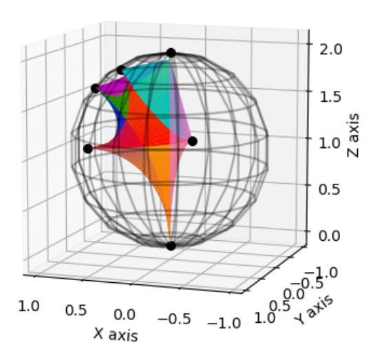
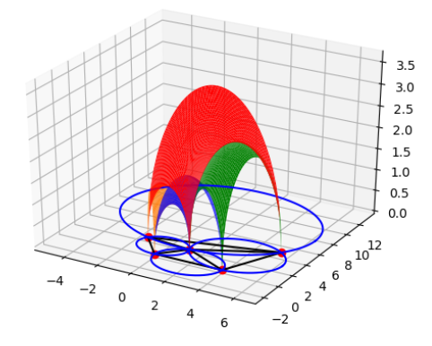
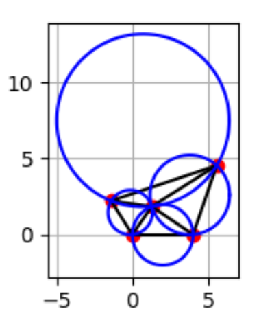
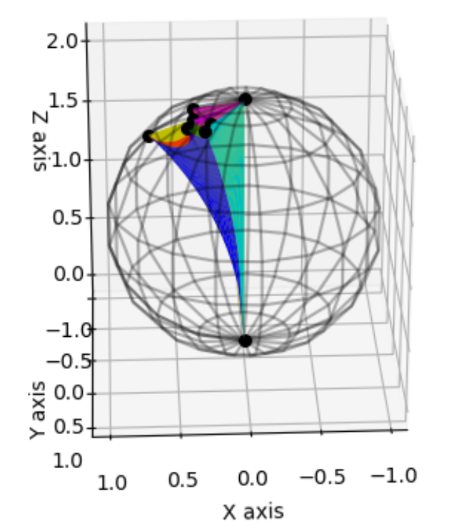
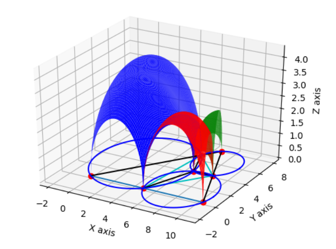
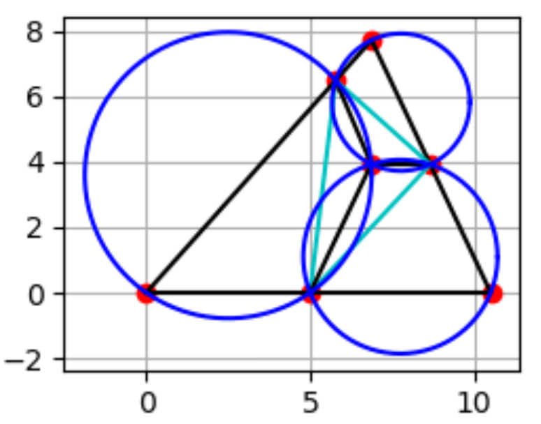

## Project Name 
Construction of Convex Ideal Polyhedra in Hyperbolic 3-Space

## Summary 
Provided a method to construct a convex ideal polyhedron (cube & octahedron) in hyperbolic 3-space given a set of internal dihedral angles.   

Details can be found in SIP_AAllgeier (submitted for library archive).pdf. 

## Generated ideal octahedron 

  
   
  

## Generated ideal cuboid

  
   
  

